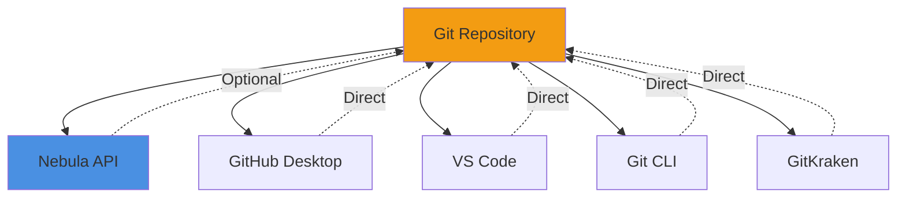

# Git Client Agnostic Architecture

## Philosophy

The Nebula Protocol is **completely Git client agnostic**. This means users can work with projects using **ANY Git client they prefer**:

- ✅ **Command Line** (`git` CLI)
- ✅ **GitHub Desktop**
- ✅ **VS Code** built-in Git
- ✅ **GitKraken**
- ✅ **Tower**
- ✅ **Sourcetree**
- ✅ **Fork**
- ✅ **Sublime Merge**
- ✅ **IntelliJ/WebStorm** built-in Git
- ✅ **Eclipse/EGit**
- ✅ **Android Studio** built-in Git
- ✅ **Xcode** built-in Git
- ✅ **Any other Git client**

---

## How It Works

### The Git Repository is the Source of Truth

The Nebula Protocol never "owns" your Git operations. Instead:

1. **Standard Git Repository** - Projects are normal Git repositories
2. **API Provides Convenience** - The Nebula API provides convenient endpoints
3. **Client Does the Same** - Any Git client can perform the same operations
4. **No Lock-In** - Switch between clients freely



---

## Example Workflows

### Workflow 1: Use Nebula API for Convenience

```bash
# Create branch via Nebula API
curl -X POST http://localhost:3000/api/project/my-app/git/branch \
  -H "Authorization: Bearer $TOKEN" \
  -d '{"branchName": "feature-auth", "checkout": true}'

# Work on feature...

# Merge via Nebula API
curl -X POST http://localhost:3000/api/project/my-app/git/merge \
  -H "Authorization: Bearer $TOKEN" \
  -d '{"sourceBranch": "feature-auth"}'
```

### Workflow 2: Use Git Client Directly

```bash
# Clone project
git clone https://github.com/username/my-app.git
cd my-app

# Create branch (same result as API)
git checkout -b feature-auth

# Work on feature...

# Merge (same result as API)
git checkout main
git merge feature-auth
git push
```

### Workflow 3: Mix Both!

```bash
# Use Nebula API to init project
POST /api/project/my-app/init

# Clone locally
git clone https://github.com/username/my-app.git

# Use GitHub Desktop for visual branch management
# (Open in GitHub Desktop)

# Use Nebula API to check status
GET /api/project/my-app/git/status

# Use VS Code for commits
# (Git panel in VS Code)

# Use CLI for push
git push origin main
```

---

## Git Operations: API vs Manual

| Operation | Nebula API | Git CLI | GitHub Desktop | VS Code |
|-----------|------------|---------|----------------|---------|
| **Init** | `POST /init` | `git init` | File → New Repo | Terminal |
| **Clone** | `POST /clone` | `git clone` | File → Clone | Terminal |
| **Branch** | `POST /branch` | `git branch` | Branch menu | Branch icon |
| **Checkout** | `POST /checkout` | `git checkout` | Click branch | Click branch |
| **Commit** | `POST /commit` | `git commit` | Commit button | Commit button |
| **Push** | `POST /commit` (with push=true) | `git push` | Push button | Push button |
| **Pull** | `POST /pull` | `git pull` | Pull button | Pull button |
| **Merge** | `POST /merge` | `git merge` | Merge button | Merge dialog |
| **Status** | `GET /status` | `git status` | Auto-display | Auto-display |

**Result:** All methods produce identical Git repository state! ✅

---

## Auto-Commits: Still Client Agnostic

The Nebula Protocol can auto-commit on milestones (Star Gates, etc.), but:

1. **Standard Git Commits** - Creates normal Git commits
2. **Visible in Any Client** - Shows up in all Git clients
3. **Can Be Amended** - Use any client to amend/revert
4. **Follows Git Rules** - Standard Git history

```bash
# Nebula auto-commits on Star Gate passage
# Result: Normal Git commit

# View in CLI
git log
# commit abc123...
# Author: Nebula Protocol
# Date: 2025-11-08
#     milestone: Pass Star Gate 1 (v0.1.1.0)

# View in GitHub Desktop
# (Shows same commit in visual history)

# View in GitKraken
# (Shows same commit in graph)

# Amend if needed
git commit --amend -m "milestone: Pass Star Gate 1 (updated message)"
```

---

## Branch Management: Works Everywhere

### Create Branch

**Via Nebula API:**
```bash
POST /api/project/my-app/git/branch
{"branchName": "feature-auth"}
```

**Via GitHub Desktop:**
- Branch → New Branch → "feature-auth"

**Via VS Code:**
- Click branch icon → Create new branch → "feature-auth"

**Via CLI:**
```bash
git checkout -b feature-auth
```

**Result:** Same branch in all clients! ✅

### Switch Branch

**Via Nebula API:**
```bash
POST /api/project/my-app/git/checkout
{"branchName": "main"}
```

**Via GitHub Desktop:**
- Click "Current Branch" → Select "main"

**Via VS Code:**
- Click branch name → Select "main"

**Via CLI:**
```bash
git checkout main
```

**Result:** All clients now show "main" as current! ✅

---

## Conflict Resolution: Use Your Preferred Tool

When merge conflicts occur:

**Nebula API:**
```bash
POST /api/project/my-app/git/merge
{"sourceBranch": "feature-auth"}

# Response: {"hasConflicts": true}
```

**Resolve With:**

1. **VS Code** - Built-in merge conflict resolver
2. **GitHub Desktop** - Visual conflict resolution
3. **GitKraken** - 3-way merge tool
4. **KDiff3** - External merge tool
5. **Vim/Emacs** - Manual resolution
6. **Any other merge tool**

Then:
```bash
git add .
git commit -m "Resolve merge conflicts"
```

**Or via Nebula API:**
```bash
POST /api/project/my-app/git/commit
{"message": "Resolve merge conflicts"}
```

Both work identically! ✅

---

## IDE Integration Examples

### VS Code + Nebula

```javascript
// VS Code extension can call Nebula API
const response = await fetch('http://localhost:3000/api/project/my-app/git/status', {
  headers: { 'Authorization': `Bearer ${token}` }
});

const status = await response.json();
// Display in VS Code sidebar

// But also use VS Code's built-in Git
// vscode.commands.executeCommand('git.commit')
// Both work together!
```

### JetBrains IDEs + Nebula

```kotlin
// IntelliJ plugin can call Nebula API for project memory
val memory = nebulaApi.getProjectMemory(projectId)

// But use IntelliJ's built-in Git for operations
GitInit.init(project, root)
GitPull.pull(project)

// Mix and match as needed!
```

### GitHub Desktop + Nebula

```bash
# User works in GitHub Desktop
# (All Git operations)

# Nebula API monitors project folder
# Detects commits, triggers Star Gate checks
# Records in project memory
# No interference with GitHub Desktop!
```

---

## Why This Matters

### 1. **No Learning Curve**

Users don't need to learn a new Git client. Use what you already know:
- Git expert? Use CLI
- Visual person? Use GitHub Desktop
- VS Code user? Use built-in Git
- Team using GitKraken? Keep using it!

### 2. **No Vendor Lock-In**

Nebula doesn't "own" your Git workflow:
- Stop using Nebula API → Still have normal Git repo
- Git operations work without Nebula running
- Switch Git clients anytime
- No proprietary Git extensions

### 3. **Team Collaboration**

Different team members can use different clients:
- Designer uses GitHub Desktop
- Frontend dev uses VS Code
- Backend dev uses CLI
- DevOps uses GitKraken
- **All work on same Nebula project!** ✅

### 4. **CI/CD Compatible**

CI/CD pipelines use standard Git:
```yaml
# GitHub Actions
- uses: actions/checkout@v3
- run: git log
- run: git diff

# Works perfectly with Nebula projects!
# No special setup needed
```

### 5. **Emergency Recovery**

If Nebula API is down:
- Git still works
- Clone/push/pull/commit all work
- No data loss
- Resume when API is back

---

## Best Practices

### 1. **Choose Your Primary Interface**

Pick what feels natural:
- **API-First:** Use Nebula API for everything (automated)
- **Client-First:** Use Git client, API for project memory only
- **Hybrid:** API for automation, client for visual tasks

### 2. **Trust Git History**

The Git repository is the source of truth:
```bash
# If confused, check Git directly
git log
git status
git branch -a

# This shows what ANY client will see
```

### 3. **Use API for Automation**

Great API use cases:
- Auto-commit on Star Gate passage
- Auto-branch for new constellations
- Sync to Central KG after merge
- Trigger builds on push

### 4. **Use Client for Visual Tasks**

Great client use cases:
- Reviewing diffs
- Resolving merge conflicts
- Interactive rebase
- Viewing history graph
- Staging specific lines

### 5. **Document Your Workflow**

Tell your team:
```markdown
# Our Git Workflow

- **Branching:** GitHub Desktop
- **Committing:** VS Code
- **Merging:** GitKraken
- **Automation:** Nebula API
- **CI/CD:** GitHub Actions

All work together seamlessly!
```

---

## Troubleshooting

### "API says different branch than my client"

**Cause:** Working directory mismatch

**Solution:**
```bash
# Check actual Git state
cd /path/to/project
git branch --show-current

# This is the truth
# API reads same information
```

### "Can't see commits made via API"

**Cause:** Client needs refresh

**Solution:**
- **GitHub Desktop:** Repository → Fetch/Pull
- **VS Code:** Click refresh icon
- **CLI:** `git fetch && git pull`

### "Merge conflicts - API or client?"

**Answer:** Use whichever is easier!

**API:**
```bash
POST /api/project/my-app/git/merge
{"sourceBranch": "feature", "autoResolveConflicts": true}
```

**Client:**
- Open in VS Code
- Resolve visually
- Commit

**Both produce identical result!**

---

## Architecture Principles

### 1. **Standard Git Only**

No custom Git objects, no proprietary extensions:
```bash
# Nebula project is a normal Git repo
git clone https://github.com/user/project.git
cd project

# Check - it's just Git!
ls -la .git/
# Standard Git directory structure ✅
```

### 2. **Git Commands Under the Hood**

Nebula API uses standard Git commands:
```javascript
// src/git/branch-management.js
execSync('git checkout -b feature-branch', { cwd: projectPath });

// Same as typing in terminal!
// No magic, no custom protocols
```

### 3. **Repository State = Truth**

Nebula never caches Git state:
```javascript
// Always reads from Git directly
const branch = execSync('git branch --show-current').toString();

// Never:
// const branch = this.cachedBranch; // ❌

// Always query Git directly ✅
```

### 4. **Idempotent Operations**

Operations produce same result regardless of how performed:
```bash
# Create branch via API
POST /api/project/my-app/git/branch {"branchName": "test"}

# Try again in CLI
git checkout -b test
# error: A branch named 'test' already exists

# Good! Both see same state ✅
```

---

## Summary

**The Nebula Protocol is Git client agnostic by design:**

✅ Use ANY Git client (CLI, GitHub Desktop, VS Code, GitKraken, etc.)  
✅ Nebula API provides convenient automation, not replacement  
✅ Standard Git repository - no lock-in  
✅ Team members can use different clients  
✅ CI/CD works without special setup  
✅ Git always works, even if Nebula API is down  
✅ Choose your workflow - API-first, client-first, or hybrid  

**Bottom Line:** The Nebula Protocol enhances your Git workflow without replacing it. Use what you love! 🚀

