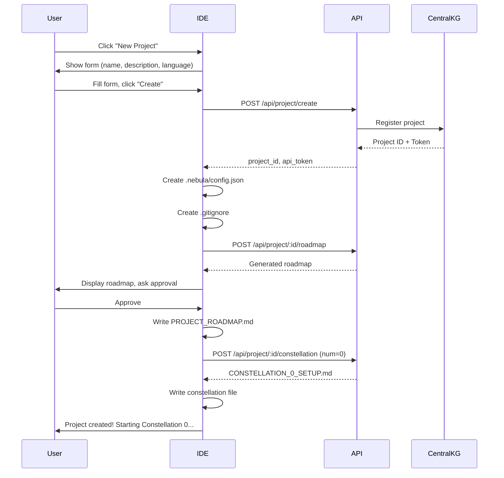
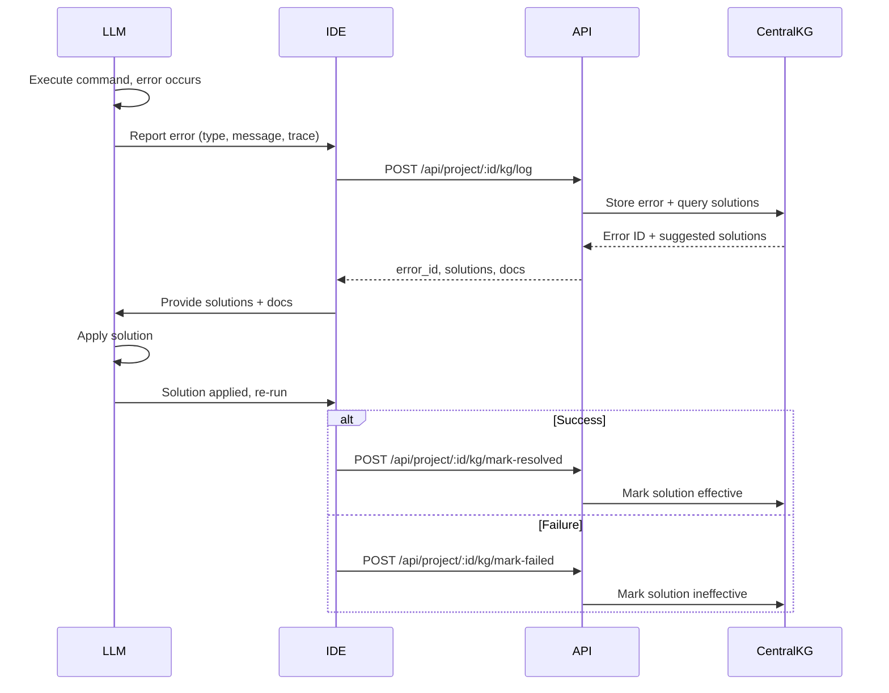

# Nebula IDE Integration Guide

**Version:** 3.0.0  
**Last Updated:** November 9, 2025  
**Target:** Nebula IDE Developers  
**Status:** Specification for IDE Launch

---

## 🎯 Purpose

This document defines the **contract** between **Nebula IDE** (Python GUI application) and the **Nebula Protocol** (Docker API + Central KG). It specifies:

1. Required API endpoints the IDE must call
2. File structure the IDE must maintain
3. User workflows from IDE interaction to protocol execution
4. Error handling and fallback behaviors

---

## 🏗️ Architecture Overview

```
┌──────────────────────────────────────────────────────┐
│ Nebula IDE (Python - Tkinter/PyQt)                   │
│ ┌──────────────────────────────────────────────────┐ │
│ │ User Interface Layer                             │ │
│ │ - Project management dashboard                   │ │
│ │ - LLM chat interface                            │ │
│ │ - Constellation/Star System browser             │ │
│ │ - Star Gate checklist UI                        │ │
│ │ - Integrated terminal                           │ │
│ └──────────────────────────────────────────────────┘ │
│                         │                            │
│ ┌──────────────────────▼────────────────────────────┐ │
│ │ IDE Core Logic                                    │ │
│ │ - API client (HTTP/REST)                         │ │
│ │ - Local file watcher                            │ │
│ │ - LLM orchestration                             │ │
│ │ - Auto-logging to KG                            │ │
│ └──────────────────────────────────────────────────┘ │
└──────────────────────┬───────────────────────────────┘
                       │ HTTP/REST (port 3000)
                       ↓
┌──────────────────────────────────────────────────────┐
│ Docker Stack (docker-compose)                        │
│ ┌────────────────────────────────────────────────┐   │
│ │ Nebula API Server (Node.js/Express)            │   │
│ │ - Project lifecycle management                 │   │
│ │ - Documentation fetching                       │   │
│ │ - Knowledge Graph operations                   │   │
│ │ - Star Gate validation                         │   │
│ └────────────────────────────────────────────────┘   │
│ ┌────────────────────────────────────────────────┐   │
│ │ PostgreSQL (Central Knowledge Graph)           │   │
│ │ - Error patterns                               │   │
│ │ - Solutions database                           │   │
│ │ - Cross-project learning                       │   │
│ └────────────────────────────────────────────────┘   │
│ ┌────────────────────────────────────────────────┐   │
│ │ Redis (Documentation Cache)                    │   │
│ │ - Official docs (24h TTL)                      │   │
│ │ - API response cache                           │   │
│ └────────────────────────────────────────────────┘   │
└──────────────────────────────────────────────────────┘
```

---

## 📁 File Structure Contract

### Required Project Structure

When the IDE creates a new project, it MUST generate this structure:

```
user-project/
├── .nebula/                          ← IDE-managed directory
│   ├── config.json                   ← Project state (see schema below)
│   ├── project_memory.db             ← SQLite local KG (auto-created)
│   ├── api_token.encrypted           ← JWT token for Central KG auth
│   └── logs/                         ← IDE operation logs
│       ├── api_calls.log
│       ├── llm_interactions.log
│       └── kg_sync.log
│
├── PROJECT_ROADMAP.md                ← User-visible, LLM-generated
├── CONSTELLATION_0_SETUP.md          ← Auto-generated by IDE
├── STAR_SYSTEM_0.1_*.md              ← Auto-generated by IDE
├── STAR_SYSTEM_0.2_*.md              ← Auto-generated by IDE
├── STAR_SYSTEM_0.3_KG_INTEGRATION.md ← MANDATORY, auto-generated
├── STAR_GATE_0_SETUP.md              ← Generated on gate check
│
├── src/                              ← LLM builds code here
│   └── [language-specific structure]
│
├── tests/                            ← LLM builds tests here
│   └── [test files]
│
├── requirements.txt / package.json   ← Dependency file
├── .gitignore                        ← Auto-generated (includes .nebula/)
└── README.md                         ← Auto-generated project summary
```

---

## 🔧 `.nebula/config.json` Schema

### Complete Schema

```json
{
  "version": "3.0.0",
  "schema_version": "1.0",
  
  "project": {
    "id": "uuid-v4-string",
    "name": "my-awesome-app",
    "description": "Brief project description from user",
    "type": "python",
    "created_at": "2025-11-09T12:00:00Z",
    "updated_at": "2025-11-09T14:30:00Z",
    "language": "python",
    "framework": "fastapi" // optional
  },
  
  "api": {
    "endpoint": "http://localhost:3000",
    "token": "jwt_token_string",
    "last_connection": "2025-11-09T14:30:00Z",
    "connection_status": "healthy" // healthy | degraded | offline
  },
  
  "structure": {
    "current_constellation": 0,
    "current_star_system": 2,
    "version": "0.1.2",
    "last_gate_passed": 0
  },
  
  "kg": {
    "enabled": true,
    "project_memory_path": ".nebula/project_memory.db",
    "central_kg_connected": true,
    "last_sync": "2025-11-09T14:30:00Z",
    "errors_logged": 5,
    "solutions_found": 3,
    "auto_sync": true
  },
  
  "star_gates": {
    "0": {
      "status": "passed",
      "passed_at": "2025-11-09T13:00:00Z",
      "tests_passed": 15,
      "coverage": 85.5,
      "git_commit": "abc123def456"
    },
    "1": {
      "status": "in_progress",
      "started_at": "2025-11-09T14:00:00Z"
    }
  },
  
  "constellations": [
    {
      "id": 0,
      "name": "Setup",
      "status": "completed",
      "star_systems": [
        {
          "id": "0.1",
          "name": "Environment",
          "status": "completed",
          "file": "STAR_SYSTEM_0.1_ENVIRONMENT.md"
        },
        {
          "id": "0.2",
          "name": "Dependencies",
          "status": "completed",
          "file": "STAR_SYSTEM_0.2_DEPENDENCIES.md"
        },
        {
          "id": "0.3",
          "name": "KG Integration",
          "status": "completed",
          "file": "STAR_SYSTEM_0.3_KG_INTEGRATION.md"
        }
      ]
    },
    {
      "id": 1,
      "name": "Core Development",
      "status": "in_progress",
      "star_systems": [
        {
          "id": "1.1",
          "name": "Database",
          "status": "in_progress",
          "file": "STAR_SYSTEM_1.1_DATABASE.md"
        }
      ]
    }
  ],
  
  "ide": {
    "last_opened": "2025-11-09T14:30:00Z",
    "llm_model": "gpt-4",
    "auto_commit": false,
    "auto_test": true
  }
}
```

### Required Fields (Minimum Viable)

```json
{
  "version": "3.0.0",
  "project": {
    "id": "uuid",
    "name": "string",
    "type": "python|javascript|rust|..."
  },
  "api": {
    "endpoint": "http://localhost:3000",
    "token": "jwt_token"
  },
  "structure": {
    "current_constellation": 0,
    "version": "0.0.0"
  },
  "kg": {
    "enabled": true,
    "project_memory_path": ".nebula/project_memory.db"
  }
}
```

---

## 🌐 Required API Endpoints

### Base URL
```
http://localhost:3000/api
```

### Authentication
All requests (except `/health`) require JWT authentication:
```http
Authorization: Bearer <jwt_token>
```

---

### 1. Health Check

#### `GET /health`
Check if API and services are running.

**Request:**
```http
GET /health
```

**Response:**
```json
{
  "status": "healthy",
  "timestamp": "2025-11-09T14:30:00Z",
  "version": "3.0.0",
  "services": {
    "api": "healthy",
    "postgres": "healthy",
    "redis": "healthy"
  }
}
```

**IDE Action:** 
- Call on startup
- If `status != "healthy"`, show error: "Nebula services not running. Please start Docker containers."

---

### 2. Project Creation

#### `POST /api/project/create`
Initialize a new project in the Central KG.

**Request:**
```json
{
  "name": "my-awesome-app",
  "description": "A REST API for managing tasks",
  "type": "python",
  "language": "python",
  "framework": "fastapi"
}
```

**Response:**
```json
{
  "project_id": "uuid-v4-string",
  "api_token": "jwt_token_for_this_project",
  "created_at": "2025-11-09T12:00:00Z",
  "initial_version": "0.0.0"
}
```

**IDE Action:**
- Call when user clicks "New Project" and describes their project
- Store `project_id` and `api_token` in `.nebula/config.json`
- Use this token for all subsequent API calls

---

### 3. Roadmap Generation

#### `POST /api/project/:id/roadmap`
Generate PROJECT_ROADMAP.md from user description.

**Request:**
```json
{
  "user_description": "I want to build a password manager with encryption and cloud sync",
  "language": "python",
  "complexity": "moderate"
}
```

**Response:**
```json
{
  "roadmap": "# Password Manager - Project Roadmap\n\n## Overview\n...",
  "suggested_constellations": [
    "Setup & Environment",
    "Core Encryption",
    "Storage Layer",
    "Cloud Sync",
    "UI Development",
    "Testing & Security",
    "Deployment"
  ],
  "estimated_complexity": "moderate"
}
```

**IDE Action:**
- Call after project creation
- Display roadmap to user for approval
- Write approved roadmap to `PROJECT_ROADMAP.md`

---

### 4. Constellation Generation

#### `POST /api/project/:id/constellation`
Generate a Constellation document (strategic overview, non-technical).

**Request:**
```json
{
  "constellation_number": 0,
  "constellation_name": "Setup & Environment",
  "context": "First phase: project structure, dependencies, KG integration"
}
```

**Response:**
```json
{
  "constellation_id": 0,
  "file_name": "CONSTELLATION_0_SETUP.md",
  "content": "# Constellation 0: Setup & Environment\n\n## Purpose\n...",
  "suggested_star_systems": [
    {
      "number": "0.1",
      "name": "Environment Setup",
      "description": "Configure Python environment, virtual env, IDE"
    },
    {
      "number": "0.2",
      "name": "Dependencies",
      "description": "Install required packages, set up requirements.txt"
    },
    {
      "number": "0.3",
      "name": "KG Integration",
      "description": "Connect to Central KG, set up project memory"
    }
  ]
}
```

**IDE Action:**
- Call when starting a new constellation
- Write `CONSTELLATION_X_NAME.md` to project root
- Update `.nebula/config.json` with constellation info

---

### 5. Star System Generation

#### `POST /api/project/:id/star-system`
Generate a Star System document (technical implementation guide).

**Request:**
```json
{
  "constellation_number": 0,
  "star_system_number": "0.3",
  "star_system_name": "KG Integration",
  "description": "Technical steps to connect project to Central KG"
}
```

**Response:**
```json
{
  "star_system_id": "0.3",
  "file_name": "STAR_SYSTEM_0.3_KG_INTEGRATION.md",
  "content": "# Star System 0.3: KG Integration\n\n## Objective\n...",
  "steps": [
    {
      "step": 1,
      "title": "Create project_memory.py",
      "commands": ["# Code to generate..."],
      "validation": "Run: python -c 'import project_memory; print(project_memory.test_connection())'"
    }
  ]
}
```

**IDE Action:**
- Call when LLM needs to implement a star system
- Write `STAR_SYSTEM_X.Y_NAME.md` to project root
- Update `.nebula/config.json`

---

### 6. Knowledge Graph Integration

#### `POST /api/project/:id/kg/init`
Initialize project memory and connect to Central KG.

**Request:**
```json
{
  "project_name": "my-awesome-app",
  "language": "python"
}
```

**Response:**
```json
{
  "kg_initialized": true,
  "project_memory_path": ".nebula/project_memory.db",
  "central_kg_connected": true,
  "initial_event_logged": {
    "event_id": "uuid",
    "message": "Project initialized",
    "timestamp": "2025-11-09T12:00:00Z"
  }
}
```

**IDE Action:**
- Call during Constellation 0, Star System 0.3
- Auto-generate `src/project_memory.py` (or equivalent for language)
- Update `.nebula/config.json` → `kg.enabled = true`

---

#### `POST /api/project/:id/kg/log`
Log an error to project memory and Central KG.

**Request:**
```json
{
  "error_type": "ImportError",
  "error_message": "No module named 'fastapi'",
  "context": {
    "file": "src/api/main.py",
    "line": 1,
    "language": "python"
  },
  "stack_trace": "Traceback...",
  "timestamp": "2025-11-09T14:30:00Z"
}
```

**Response:**
```json
{
  "error_id": "uuid",
  "logged_to_project_memory": true,
  "synced_to_central_kg": true,
  "suggested_solutions": [
    {
      "solution_id": "uuid",
      "description": "Install fastapi: pip install fastapi",
      "success_rate": 0.98,
      "used_count": 1523
    }
  ],
  "documentation_links": [
    {
      "title": "FastAPI Installation",
      "url": "https://fastapi.tiangolo.com/#installation"
    }
  ]
}
```

**IDE Action:**
- Call AUTOMATICALLY whenever LLM encounters an error
- Display suggested solutions in chat UI
- Track errors logged in `.nebula/config.json`

---

#### `GET /api/project/:id/kg/solutions?query=<error_message>`
Query Central KG for known solutions.

**Request:**
```http
GET /api/project/:id/kg/solutions?query=ImportError%20fastapi
```

**Response:**
```json
{
  "query": "ImportError fastapi",
  "solutions": [
    {
      "solution_id": "uuid",
      "description": "Install FastAPI via pip",
      "command": "pip install fastapi",
      "success_rate": 0.98,
      "projects_used": 1523,
      "last_successful": "2025-11-08T10:00:00Z"
    }
  ]
}
```

**IDE Action:**
- Call when user asks "How do I fix [error]?"
- Show solutions in priority order (by success_rate)

---

### 7. Star Gate Validation

#### `POST /api/project/:id/gate/check`
Run Star Gate validation checklist.

**Request:**
```json
{
  "constellation_number": 0,
  "gate_number": 0,
  "checklist": {
    "tests_passing": true,
    "coverage_percent": 85.5,
    "git_committed": true,
    "git_commit_sha": "abc123def456",
    "manual_verification": true,
    "errors_logged": 5
  }
}
```

**Response:**
```json
{
  "gate_passed": true,
  "gate_id": 0,
  "passed_at": "2025-11-09T14:30:00Z",
  "validation_results": {
    "tests": {
      "status": "pass",
      "count": 15,
      "failures": 0
    },
    "coverage": {
      "status": "pass",
      "percent": 85.5,
      "threshold": 80.0
    },
    "git": {
      "status": "pass",
      "committed": true,
      "pushed": true,
      "sha": "abc123def456"
    },
    "kg": {
      "status": "pass",
      "errors_logged": 5,
      "minimum_required": 1
    }
  },
  "next_constellation": 1,
  "new_version": "0.2.0"
}
```

**IDE Action:**
- Call when user clicks "Complete Constellation 0"
- If `gate_passed = false`, show blocking errors
- If `gate_passed = true`, update version and allow progression
- Generate `STAR_GATE_X_NAME.md` with results

---

#### `GET /api/project/:id/gate/status`
Get current Star Gate checklist status.

**Request:**
```http
GET /api/project/:id/gate/status?gate=0
```

**Response:**
```json
{
  "gate_number": 0,
  "status": "in_progress",
  "checklist": [
    {
      "item": "All tests passing",
      "status": "complete",
      "details": "15/15 tests passing"
    },
    {
      "item": "Code coverage >= 80%",
      "status": "complete",
      "details": "85.5% coverage"
    },
    {
      "item": "Code committed to Git",
      "status": "complete",
      "details": "Commit: abc123def456"
    },
    {
      "item": "Minimum 1 error logged to KG",
      "status": "incomplete",
      "details": "0 errors logged (need 1+)"
    },
    {
      "item": "Manual verification",
      "status": "pending",
      "details": "Awaiting user confirmation"
    }
  ],
  "can_proceed": false,
  "blocking_items": ["Minimum 1 error logged to KG"]
}
```

**IDE Action:**
- Display Star Gate checklist in UI
- Show progress bars/checkmarks
- Highlight blocking items in red

---

### 8. Version Management

#### `GET /api/project/:id/version`
Get current project version.

**Request:**
```http
GET /api/project/:id/version
```

**Response:**
```json
{
  "version": "0.2.3",
  "major": 0,
  "minor": 2,
  "patch": 3,
  "current_constellation": 1,
  "constellations_completed": 1,
  "star_systems_completed": 5,
  "last_updated": "2025-11-09T14:30:00Z"
}
```

---

#### `POST /api/project/:id/version/bump`
Bump project version.

**Request:**
```json
{
  "component": "minor",
  "reason": "Constellation 1 completed"
}
```

**Response:**
```json
{
  "old_version": "0.1.5",
  "new_version": "0.2.0",
  "bumped_at": "2025-11-09T14:30:00Z"
}
```

**IDE Action:**
- Call automatically when:
  - **Constellation completes** → bump MINOR
  - **Star System completes** → bump PATCH
  - **Production release** → bump MAJOR (manual)

---

### 9. Dynamic Documentation

#### `POST /api/docs/fetch`
Fetch official documentation for an error.

**Request:**
```json
{
  "language": "python",
  "error_type": "ImportError",
  "error_message": "No module named 'fastapi'",
  "framework": "fastapi"
}
```

**Response:**
```json
{
  "documentation": {
    "title": "FastAPI Installation",
    "url": "https://fastapi.tiangolo.com/#installation",
    "content": "Installation instructions...",
    "related_links": [
      {
        "title": "Requirements",
        "url": "https://fastapi.tiangolo.com/#requirements"
      }
    ]
  },
  "cached": false,
  "fetched_at": "2025-11-09T14:30:00Z"
}
```

**IDE Action:**
- Call when error occurs
- Display documentation in sidebar
- Cache response for 24h

---

## 🔄 User Workflows

### Workflow 1: Create New Project



**IDE Implementation:**
```python
def create_new_project(name, description, language):
    # 1. Call API to create project
    response = api_client.post("/api/project/create", {
        "name": name,
        "description": description,
        "type": language,
        "language": language
    })
    project_id = response["project_id"]
    token = response["api_token"]
    
    # 2. Create .nebula/ directory
    os.makedirs(f"{name}/.nebula", exist_ok=True)
    
    # 3. Write config.json
    config = {
        "version": "3.0.0",
        "project": {
            "id": project_id,
            "name": name,
            "type": language
        },
        "api": {
            "endpoint": "http://localhost:3000",
            "token": token
        },
        "structure": {
            "current_constellation": 0,
            "version": "0.0.0"
        },
        "kg": {
            "enabled": False  # Will enable in Star System 0.3
        }
    }
    with open(f"{name}/.nebula/config.json", "w") as f:
        json.dump(config, f, indent=2)
    
    # 4. Generate roadmap
    roadmap_response = api_client.post(f"/api/project/{project_id}/roadmap", {
        "user_description": description,
        "language": language
    })
    
    # 5. Show roadmap to user for approval
    if user_approves(roadmap_response["roadmap"]):
        with open(f"{name}/PROJECT_ROADMAP.md", "w") as f:
            f.write(roadmap_response["roadmap"])
    
    # 6. Generate Constellation 0
    constellation_response = api_client.post(
        f"/api/project/{project_id}/constellation",
        {"constellation_number": 0, "constellation_name": "Setup"}
    )
    
    with open(f"{name}/CONSTELLATION_0_SETUP.md", "w") as f:
        f.write(constellation_response["content"])
    
    return project_id
```

---

### Workflow 2: Automatic Error Logging



**IDE Implementation:**
```python
def handle_error(error_type, error_message, context):
    # 1. Log error to Central KG
    response = api_client.post(f"/api/project/{project_id}/kg/log", {
        "error_type": error_type,
        "error_message": error_message,
        "context": context,
        "timestamp": datetime.now().isoformat()
    })
    
    # 2. Get suggested solutions
    solutions = response["suggested_solutions"]
    docs = response["documentation_links"]
    
    # 3. Show to LLM
    llm_context = f"""
Error occurred: {error_message}

Suggested solutions from Central KG:
{format_solutions(solutions)}

Official documentation:
{format_docs(docs)}

Please apply the most appropriate solution.
"""
    
    # 4. LLM applies solution
    llm_response = llm.generate(llm_context)
    
    # 5. Track resolution
    if solution_worked:
        api_client.post(f"/api/project/{project_id}/kg/mark-resolved", {
            "error_id": response["error_id"],
            "solution_applied": llm_response["solution"]
        })
    
    return llm_response
```

---

### Workflow 3: Star Gate Validation

```mermaid
sequenceDiagram
    participant User
    participant IDE
    participant API
    
    User->>IDE: Click "Complete Constellation 0"
    
    IDE->>IDE: Run automated checks
    Note over IDE: - Run tests<br/>- Check coverage<br/>- Verify git status<br/>- Count errors logged
    
    IDE->>API: GET /api/project/:id/gate/status?gate=0
    API-->>IDE: Checklist with status
    
    IDE->>User: Display checklist UI
    
    alt All checks pass
        User->>IDE: Confirm manual verification
        IDE->>API: POST /api/project/:id/gate/check
        API-->>IDE: gate_passed=true, new_version
        IDE->>IDE: Update .nebula/config.json
        IDE->>IDE: Generate STAR_GATE_0_SETUP.md
        IDE->>User: ✅ Constellation 0 complete! Now v0.1.0
    else Checks fail
        IDE->>User: ❌ Cannot proceed, fix blocking items
        Note over User: - Item 1: incomplete<br/>- Item 2: incomplete
    end
```



**IDE Implementation:**
```python
def check_star_gate(constellation_number):
    # 1. Get checklist status from API
    status = api_client.get(
        f"/api/project/{project_id}/gate/status?gate={constellation_number}"
    )
    
    # 2. Display in UI
    display_checklist(status["checklist"])
    
    # 3. If all complete, allow user to proceed
    if status["can_proceed"]:
        if user_confirms_manual_verification():
            # 4. Submit gate check
            result = api_client.post(
                f"/api/project/{project_id}/gate/check",
                {
                    "constellation_number": constellation_number,
                    "gate_number": constellation_number,
                    "checklist": {
                        "tests_passing": True,
                        "coverage_percent": get_coverage(),
                        "git_committed": True,
                        "git_commit_sha": get_latest_commit_sha(),
                        "manual_verification": True,
                        "errors_logged": count_errors_logged()
                    }
                }
            )
            
            if result["gate_passed"]:
                # 5. Update config
                update_config_version(result["new_version"])
                
                # 6. Generate Star Gate document
                generate_star_gate_document(constellation_number, result)
                
                # 7. Show success
                show_success(f"Constellation {constellation_number} complete! Now v{result['new_version']}")
            else:
                show_error("Star Gate validation failed", result["blocking_items"])
    else:
        show_error("Cannot proceed", status["blocking_items"])
```

---

## 🛠️ IDE Responsibilities

### What IDE MUST Do Automatically

1. **On Startup:**
   - Check Docker services (`GET /health`)
   - If offline, prompt user to start Docker
   - Load `.nebula/config.json` for open projects

2. **On Project Create:**
   - Generate `.nebula/` directory
   - Create `config.json`
   - Call API to initialize project in Central KG
   - Generate PROJECT_ROADMAP.md (via API)
   - Generate CONSTELLATION_0_SETUP.md (via API)

3. **During Development:**
   - **Auto-log every error** to Central KG (via `POST /api/project/:id/kg/log`)
   - Fetch suggested solutions and show to LLM
   - Sync `.nebula/config.json` after each constellation/star system change
   - Track version changes

4. **On Star Gate:**
   - Run automated checks (tests, coverage, git)
   - Call `GET /api/project/:id/gate/status`
   - Display checklist UI
   - Block progression if checks fail
   - Call `POST /api/project/:id/gate/check` when ready

5. **On Constellation Complete:**
   - Bump version (MINOR)
   - Generate STAR_GATE document
   - Update config.json

---

### What IDE Should NOT Do

1. **Don't** let users manually edit `.nebula/config.json` (IDE manages it)
2. **Don't** allow skipping Star Gates (enforce validation)
3. **Don't** allow progression if Docker services offline
4. **Don't** let users disable KG logging (mandatory)

---

## 🚨 Error Handling

### API Unreachable

```python
try:
    response = api_client.get("/health")
except ConnectionError:
    show_error(
        title="Nebula Services Offline",
        message="Cannot connect to Nebula API. Please ensure Docker containers are running.",
        actions=[
            "Start Docker Desktop",
            "Run: docker start nebula-central-kg-db nebula-central-kg-redis"
        ]
    )
    # IDE enters "offline mode" - local operations only
```

### API Errors

```python
response = api_client.post("/api/project/create", data)
if response.status_code != 200:
    error = response.json()
    show_error(
        title=f"API Error: {error['code']}",
        message=error['message'],
        details=error.get('details', '')
    )
```

### Invalid Token

```python
if response.status_code == 401:
    # Token expired or invalid
    show_error("Authentication failed. Please re-authenticate.")
    # Trigger re-auth flow
```

---

## 📊 Config Updates

### When to Update `.nebula/config.json`

| Event | Field to Update | New Value |
|-------|----------------|-----------|
| Constellation starts | `structure.current_constellation` | `N` |
| Star System completes | `structure.version` | Bump PATCH |
| Constellation completes | `structure.version` | Bump MINOR |
| Star Gate passes | `star_gates[N].status` | `"passed"` |
| Error logged | `kg.errors_logged` | Increment by 1 |
| KG sync | `kg.last_sync` | Current timestamp |

**IDE should auto-save config after each change.**

---

## 🔐 Security Considerations

1. **API Token Storage:**
   - Store in `.nebula/api_token.encrypted`
   - Encrypt with user's system keyring
   - Never commit to git (.gitignore includes `.nebula/`)

2. **Central KG Access:**
   - Each project has unique JWT token
   - Token expires after 30 days (refresh via API)
   - Rate limiting: 100 requests/minute per project

3. **Local Project Memory:**
   - SQLite database in `.nebula/project_memory.db`
   - No sensitive data stored (error messages only)
   - Synced to Central KG (anonymized)

---

## 🧪 Testing IDE Integration

### Minimum Tests Required

1. **API Connection:**
   ```python
   def test_api_health_check():
       response = api_client.get("/health")
       assert response["status"] == "healthy"
   ```

2. **Project Creation:**
   ```python
   def test_create_project():
       response = api_client.post("/api/project/create", {
           "name": "test-project",
           "type": "python"
       })
       assert "project_id" in response
       assert "api_token" in response
   ```

3. **Error Logging:**
   ```python
   def test_log_error():
       response = api_client.post(f"/api/project/{project_id}/kg/log", {
           "error_type": "TestError",
           "error_message": "Test error message"
       })
       assert response["logged_to_project_memory"] == True
       assert len(response["suggested_solutions"]) >= 0
   ```

4. **Star Gate Validation:**
   ```python
   def test_gate_check():
       response = api_client.post(f"/api/project/{project_id}/gate/check", {
           "constellation_number": 0,
           "checklist": {...}
       })
       assert "gate_passed" in response
   ```

---

## 📝 Summary

### Critical Requirements

✅ **IDE MUST:**
1. Call `GET /health` on startup
2. Create `.nebula/config.json` for every project
3. Auto-log EVERY error to Central KG
4. Block Star Gate progression if checks fail
5. Enforce KG integration in Constellation 0

✅ **API MUST Provide:**
1. Project lifecycle endpoints (create, roadmap, constellation, star-system)
2. KG integration endpoints (init, log, query)
3. Star Gate validation endpoints (check, status)
4. Version management endpoints (get, bump)

✅ **Together They Deliver:**
- Zero-setup KG integration for users
- Automatic error tracking and solution suggestion
- Enforced quality gates
- Cross-project learning

---

**Next Steps:**
1. API developers: Implement missing endpoints from this spec
2. IDE developers: Implement workflows and auto-logging
3. Test integration end-to-end with sample Python project

---

**Version:** 3.0.0  
**Last Updated:** November 9, 2025  
**Maintainer:** Nebula Protocol Team

