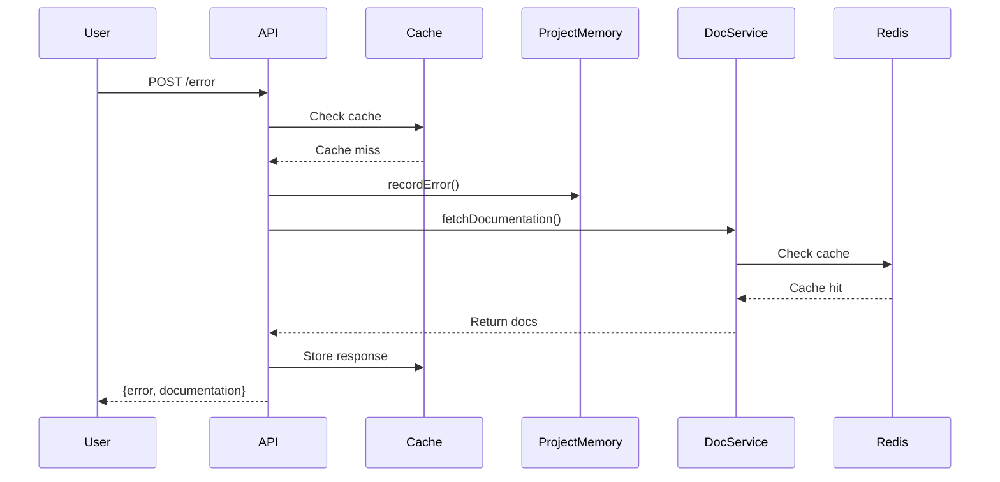
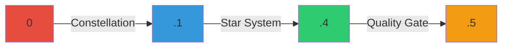

# Nebula Protocol - AI-Assisted Development Framework

**Version:** 2.0.0 (Docker API + Dynamic Documentation)  
**Status:** Production Ready  
**Architecture:** Dockerized REST API + Centralized Knowledge Graph

---

## 🌌 What is Nebula Protocol?

Nebula Protocol is a **dynamic, flexible framework** for AI-assisted software development that provides:

- **🏗️ Adaptive Structure:** Constellations → Star Systems → Star Gates (grows with project complexity)
- **🐳 Docker API:** REST API for remote/team deployment (no IDE dependency)
- **📚 Dynamic Docs:** Automatic documentation fetching from official sources when errors occur
- **🧠 Knowledge Graph:** PostgreSQL-backed cross-project learning and pattern recognition
- **📊 Semantic Versioning:** Auto-tracking: `CONSTELLATION.STAR_SYSTEM.QUALITY_GATE.PATCH`
- **🚪 Quality Gates:** Mandatory testing and validation between phases
- **🔄 Auto-Sync:** Project KG + Central KG synchronization on milestones

---

## 🚀 Quick Start

### Option 1: Docker Deployment (Recommended)

**For teams, production, or centralized deployment:**

```bash
# 1. Clone repository
git clone https://github.com/JCorellaFSL/Nebula-Protocol.git
cd Nebula-Protocol

# 2. Configure
cp .env.example .env
# Edit .env with your settings (JWT_SECRET, passwords, etc.)

# 3. Start services (Windows)
scripts\start.bat

# Or (Linux/Mac)
chmod +x scripts/start.sh
./scripts/start.sh

# 4. Verify
curl http://localhost:3000/health
```

**Services:**
- API: http://localhost:3000
- PostgreSQL: localhost:5432
- Redis: localhost:6379
- Monitoring: http://localhost:9090 (optional)

**See:** [DOCKER_DEPLOYMENT.md](./DOCKER_DEPLOYMENT.md) for complete guide

---

### Option 2: Local MCP Server (Optional)

**For local IDE integration only (Cursor/VSCode):**

The MCP server is included but **optional**. Most users should use the Docker API instead.

If you still want local MCP:
```bash
npm install
node nebula-framework-mcp.js
```

---

## 📖 Documentation Structure

### Core Documentation
- **[Nebula_Protocol.md](./Nebula_Protocol.md)** - Framework specification
- **[IMPLEMENTATION_GUIDE.md](./IMPLEMENTATION_GUIDE.md)** - How to implement
- **[USAGE_GUIDE.md](./USAGE_GUIDE.md)** - How to use the framework

### Docker & API
- **[DOCKER_DEPLOYMENT.md](./DOCKER_DEPLOYMENT.md)** - Complete deployment guide (726 lines)
- **[DOCKER_README.md](./DOCKER_README.md)** - Quick start & architecture (443 lines)
- **[DYNAMIC_DOCUMENTATION.md](./DYNAMIC_DOCUMENTATION.md)** - Auto-doc fetching feature (557 lines)

### Language & Framework Support
- **[LANGUAGE_SUPPORT.md](./LANGUAGE_SUPPORT.md)** - Complete language/framework matrix (11 languages)

### Language Adaptations
- **[FLUTTER_NEBULA_ADAPTATION.md](./FLUTTER_NEBULA_ADAPTATION.md)** - Flutter/Dart projects
- **[RUST_NEBULA_ADAPTATION.md](./RUST_NEBULA_ADAPTATION.md)** - Rust projects
- **[PYTHON_NEBULA_ADAPTATION.md](./PYTHON_NEBULA_ADAPTATION.md)** - Python projects
- **[TAURI_NEBULA_ADAPTATION.md](./TAURI_NEBULA_ADAPTATION.md)** - Tauri projects
- **[DIOXUS_NEBULA_ADAPTATION.md](./DIOXUS_NEBULA_ADAPTATION.md)** - Dioxus projects

**Note:** Adaptation files for Java, C#, Go, PHP, Swift, Kotlin coming soon. All languages fully supported by API.

### Templates
- **[TEMPLATE_CONSTELLATION.md](./TEMPLATE_CONSTELLATION.md)** - Strategic overview template
- **[TEMPLATE_STAR_SYSTEM.md](./TEMPLATE_STAR_SYSTEM.md)** - Technical implementation template
- **[TEMPLATE_STAR_GATE.md](./TEMPLATE_STAR_GATE.md)** - Quality gate checkpoint template
- **[TEMPLATE_PROJECT_GUIDE.md](./TEMPLATE_PROJECT_GUIDE.md)** - Project-specific guide template

### Additional Guides
- **[STAR_SYSTEM_GUIDELINES.md](./STAR_SYSTEM_GUIDELINES.md)** - Context optimization principles
- **[updates/SEPARATION_OF_CONCERNS.md](./updates/SEPARATION_OF_CONCERNS.md)** - Two-tier architecture
- **[updates/README.md](./updates/README.md)** - Framework update timeline

---

## 🏗️ Framework Concepts

### Constellations (Strategic Overview)
**WHAT and WHY** - Non-technical, business-focused descriptions of major phases.

Example: `CONSTELLATION_0_SETUP.md`
- Purpose of the phase
- Goals and deliverables
- Business value
- Dependencies

### Star Systems (Technical Implementation)
**HOW** - Technical step-by-step instructions for implementation.

Example: `STAR_SYSTEM_0.1_ENVIRONMENT.md`
- Specific commands
- Code examples
- Configuration details
- Testing procedures

**Quantity by Complexity:**
- Simple: 1-2 Star Systems per Constellation
- Moderate: 2-4 Star Systems per Constellation
- Complex: 3-8 Star Systems per Constellation

### Star Gates (Quality Checkpoints)
**VALIDATION** - Mandatory checkpoints between Constellations.

Requirements:
- ✅ All Star Systems complete
- ✅ Automated tests passing
- ✅ Manual verification complete
- ✅ Code pushed to remote repository
- ✅ Documentation updated
- ✅ Performance acceptable

---

## 🔧 Initialize a New Project

```bash
# Simple project (3 constellations, 1-2 star systems each)
npx init-nebula my-project simple

# Moderate project (5 constellations, 2-4 star systems each)
npx init-nebula my-project moderate

# Complex project (5+ constellations, 3-8 star systems each)
npx init-nebula my-project complex
```

**Generates:**
- `ROADMAP.md` - Project overview
- `CONSTELLATION_*.md` - Strategic phase documents
- `STAR_SYSTEM_*.md` - Technical implementation guides
- `STAR_GATE_*.md` - Quality checkpoint templates
- `.nebula/` - Project memory (SQLite)

---

## 🏗️ Architecture Overview

### System Architecture

```mermaid
graph TB
    A[User/IDE] -->|HTTP/REST| B[Nginx Reverse Proxy]
    B --> C[Nebula API Server]
    C --> D[PostgreSQL<br/>Central KG]
    C --> E[Redis<br/>Doc Cache]
    C --> F[Project Memory<br/>SQLite]
    C --> G[Documentation Service]
    G -->|Fetch| H[Official Docs<br/>11 Languages]
    C --> I[Star Chart<br/>Global KG]
    
    style C fill:#4a90e2
    style D fill:#336791
    style E fill:#dc382d
    style F fill:#003b57
    style G fill:#f39c12
```



### Data Flow



---

## 🌐 API Architecture

### REST API Endpoints

#### Authentication
```bash
POST /api/auth/token
```

#### Project Management
```bash
POST /api/project/:id/init
GET  /api/project/:id/version
POST /api/project/:id/version/bump
POST /api/project/:id/error
POST /api/project/:id/solution
POST /api/project/:id/star-gate
GET  /api/project/:id/stats
```

#### Knowledge Graph
```bash
POST /api/kg/node
POST /api/kg/link
POST /api/kg/event
POST /api/kg/lesson
GET  /api/kg/lessons/:constellation
```

#### Dynamic Documentation
```bash
POST /api/docs/fetch
GET  /api/docs/search
GET  /api/docs/related
POST /api/docs/extract-error
```

**See:** [DOCKER_DEPLOYMENT.md](./DOCKER_DEPLOYMENT.md#api-endpoints) for full API reference

---

## 📊 Semantic Versioning

### Version Format



**Format:** `CONSTELLATION.STAR_SYSTEM.QUALITY_GATE.PATCH`

**Example:** `0.1.4.5`
- `0` = Constellation 0 (Setup)
- `1` = Star System 1 (Environment)
- `4` = 4th Quality Gate passed
- `5` = 5th bug fix/patch

**Auto-Bumps:**
- ✅ **Patch:** When solution is recorded
- ✅ **Quality Gate:** When Star Gate is passed
- ✅ **Star System:** Manual (constellation manager's decision)
- ✅ **Constellation:** Manual (major milestone)

---

## 📚 Dynamic Documentation

**Problem:** Cursor's "link to documentation" is clunky and requires pre-indexing GBs of docs.

**Solution:** Automatic documentation fetching from official sources when errors occur.

```javascript
// Error logged
POST /api/project/my-project/error
{
  "language": "Rust",
  "message": "error[E0308]: type mismatch"
}

// Response includes documentation
{
  "errorId": "...",
  "documentation": {
    "errorCode": "E0308",
    "url": "https://doc.rust-lang.org/error_index.html#E0308",
    "explanation": "Type mismatch occurs when...",
    "relatedLinks": [...]
  }
}
```

### Supported Languages (11 total)

**Tier 1 - Production Ready (10 languages):**
1. ✅ **Rust** - E0xxx errors, docs.rs, Rust Book
2. ✅ **Python** - Exceptions, PyPI, official docs
3. ✅ **JavaScript/TypeScript** - MDN, Node.js API, TS compiler errors
4. ✅ **Java** - Exceptions, JavaDoc, Oracle docs
5. ✅ **C# / .NET** - CSxxxx errors, Microsoft Learn
6. ✅ **Go** - Error interface, pkg.go.dev
7. ✅ **PHP** - Exceptions, php.net manual
8. ✅ **Swift** - Error protocol, Apple Developer docs
9. ✅ **Kotlin** - Exceptions, kotlinlang.org
10. ✅ **Dart/Flutter** - Widget errors, Flutter API

**Tier 2 - Work In Progress (1 language):**
11. ⚠️  **C++** - WIP, requires clang-tidy/cppcheck for full support

**Popular Frameworks (15+):**
- Web: React, Next.js, Vue, Angular, Svelte
- Backend: Django, FastAPI, Spring Boot, ASP.NET Core, Express, NestJS
- Mobile: Flutter, React Native, SwiftUI
- Desktop: Tauri, Electron, Dioxus

**See:** [LANGUAGE_SUPPORT.md](./LANGUAGE_SUPPORT.md) for complete details

**Benefits:**
- ✅ 11 languages supported (10 production + 1 WIP)
- ✅ Always up-to-date (live from official sources)
- ✅ Minimal storage (Redis cache, 24h TTL)
- ✅ Fast (5ms cached, 200ms first fetch)
- ✅ Automatic (no manual linking needed)

**See:** [DYNAMIC_DOCUMENTATION.md](./DYNAMIC_DOCUMENTATION.md)

---

## 🧠 Knowledge Graph

### Local Project Memory
- Error tracking and solutions
- Decision history
- Context snapshots
- Pattern recognition

### Centralized Knowledge Graph (PostgreSQL)
- Cross-project error patterns
- Community solutions
- Technology relationships
- Success rate tracking
- Lesson learning

**See:** [nebula-kg/CONNECTION_GUIDE.md](./nebula-kg/CONNECTION_GUIDE.md)

---

## 🎯 Key Features

### 1. Adaptive Structure
- Simple projects: 3 constellations, minimal Star Systems
- Complex projects: Expand organically as complexity emerges
- No forced bureaucracy

### 2. Docker API
- REST API for all operations
- JWT authentication
- Rate limiting
- Health checks
- Production-ready

### 3. Automatic Documentation
- Fetches official docs on errors
- Redis caching (24h TTL)
- Supports multiple languages
- Always fresh

### 4. Quality Enforcement
- Mandatory Star Gates between Constellations
- Test requirements (automated + manual)
- Git push validation
- Performance checks

### 5. Smart Learning
- Central KG tracks cross-project patterns
- Solution effectiveness ratings
- Error resolution time tracking
- Community knowledge sharing

---

## 🛠️ Tools

### Constellation Analyzer
Analyze constellation/star system complexity:

```bash
npx analyze-constellation CONSTELLATION_1_CORE.md
```

**Checks:**
- Token count (optimal: 1000-4000)
- Task count (optimal: 5-15)
- Section count (optimal: 3-8)
- Provides split/merge recommendations

### Project Initialization
Dynamic constellation generation:

```bash
npx init-nebula my-project moderate
```

### Version Management
API-driven versioning:

```bash
curl -X POST http://localhost:3000/api/project/my-project/version/bump \
  -H "Authorization: Bearer TOKEN" \
  -d '{"component": "quality_gate"}'
```

---

## 📦 Installation

### Prerequisites
- Docker Desktop (20.10+)
- Docker Compose (v2.0+)
- Node.js 20+ (for development)
- 4GB RAM minimum (8GB recommended)

### Setup

```bash
# Clone
git clone https://github.com/JCorellaFSL/Nebula-Protocol.git
cd Nebula-Protocol

# Install dependencies (optional, for local development)
npm install

# Configure
cp .env.example .env
# Edit .env with your settings

# Start Docker services
./scripts/start.sh  # Linux/Mac
# or
scripts\start.bat   # Windows

# Verify
curl http://localhost:3000/health
```

---

## 🚀 Deployment Options

### 1. Local Development
```bash
docker-compose up -d
```

### 2. Bare Metal Server
```bash
# Configure SSL via Let's Encrypt
# Update .env with domain
# Start services
docker-compose up -d
```

### 3. Cloud (AWS/GCP/Azure)
- Use managed PostgreSQL (RDS/Cloud SQL)
- Use managed Redis (ElastiCache/Memorystore)
- Deploy API to ECS/Cloud Run/App Service
- Configure load balancer for SSL

**See:** [DOCKER_DEPLOYMENT.md](./DOCKER_DEPLOYMENT.md#production-deployment)

---

## 🤝 Contributing

See [CONTRIBUTING.md](./CONTRIBUTING.md)

---

## 📄 License

MIT License - See [LICENSE](./LICENSE)

---

## 🆘 Support

- **Documentation:** This README + linked guides
- **Issues:** [GitHub Issues](https://github.com/JCorellaFSL/Nebula-Protocol/issues)
- **Discussions:** [GitHub Discussions](https://github.com/JCorellaFSL/Nebula-Protocol/discussions)

---

## 🗺️ Project Structure

```
Nebula-Protocol/
├── Core Framework
│   ├── Nebula_Protocol.md          (Framework spec)
│   ├── IMPLEMENTATION_GUIDE.md     (Implementation details)
│   └── USAGE_GUIDE.md              (Usage guide)
│
├── Docker Deployment
│   ├── docker-compose.yml          (Multi-service orchestration)
│   ├── Dockerfile                  (API server image)
│   ├── DOCKER_DEPLOYMENT.md        (Deployment guide)
│   ├── DOCKER_README.md            (Quick start)
│   └── scripts/                    (Start/stop scripts)
│
├── API & Services
│   ├── nebula-api-server.js        (Express REST API)
│   ├── nebula-docs-service.js      (Dynamic documentation)
│   ├── project-memory.js           (SQLite project memory)
│   ├── star-chart.js               (Global knowledge graph)
│   └── init-nebula-project.js      (Project initialization)
│
├── Database
│   └── db/init.sql                 (PostgreSQL schema)
│
├── Language Adaptations
│   ├── FLUTTER_NEBULA_ADAPTATION.md
│   ├── RUST_NEBULA_ADAPTATION.md
│   ├── PYTHON_NEBULA_ADAPTATION.md
│   ├── TAURI_NEBULA_ADAPTATION.md
│   └── DIOXUS_NEBULA_ADAPTATION.md
│
├── Templates
│   ├── TEMPLATE_CONSTELLATION.md
│   ├── TEMPLATE_STAR_SYSTEM.md
│   ├── TEMPLATE_STAR_GATE.md
│   └── TEMPLATE_PROJECT_GUIDE.md
│
└── Updates History
    └── updates/                    (Framework evolution)
```

---

**Built with:** Docker, Node.js, Express, PostgreSQL, Redis, Nginx  
**Deployment:** Local, Bare Metal, Cloud  
**Architecture:** REST API, Microservices, Centralized KG  

**Version:** 2.0.0  
**Last Updated:** November 8, 2025
