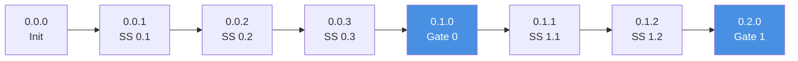
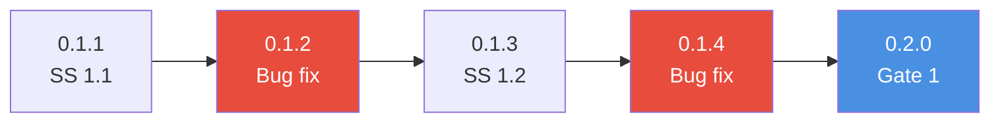
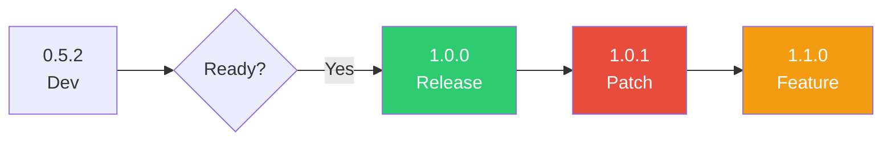

# Nebula Protocol Versioning

**Version:** 3.0.0  
**Last Updated:** November 9, 2025  
**Status:** Official Specification

---

## 🎯 Overview

Nebula Protocol uses **standard semantic versioning** (MAJOR.MINOR.PATCH) with internal mapping to constellation/star system progress. This approach ensures compatibility with package managers (npm, pip, cargo) while maintaining clear progression tracking.

---

## 📊 Version Format

```
MAJOR.MINOR.PATCH
  │     │     └─ Star System completion, bug fixes, patches
  │     └─ Constellation completion
  └─ Breaking changes, major milestones, production releases
```

### Examples

| Version | Meaning | Trigger Event |
|---------|---------|---------------|
| `0.0.0` | Project initialized | Project creation |
| `0.1.0` | Constellation 0 complete | Star Gate 0 passed |
| `0.1.1` | Star System 0.1 done | Star System completion |
| `0.2.0` | Constellation 1 complete | Star Gate 1 passed |
| `0.3.2` | Constellation 2, Star System 2 + patch | Multiple star systems + bugfix |
| `1.0.0` | Production release | Manual decision |
| `2.0.0` | Breaking changes | Manual decision |

---

## 🔢 Version Component Rules

### MAJOR (Breaking Changes / Production Releases)

**When to bump:**
- ✅ First production release (`1.0.0`)
- ✅ Breaking API changes (incompatible with previous version)
- ✅ Major architectural refactor
- ✅ Platform/framework version upgrade (Python 3 → 4, major library upgrade)

**Who decides:** **Manual decision** by project lead or team

**Examples:**
```
0.8.5 → 1.0.0   (production release)
1.5.2 → 2.0.0   (breaking API change)
2.3.1 → 3.0.0   (major refactor)
```

**NOT automatically bumped.** Requires explicit intent.

---

### MINOR (Constellation Completion)

**When to bump:**
- ✅ **Constellation complete** → Star Gate passed
- ✅ Major feature addition (new functionality)
- ✅ Significant milestone reached

**Who decides:** **Automatic** when Star Gate passes OR **manual** for feature additions outside constellation structure

**Examples:**
```
0.0.0 → 0.1.0   (Constellation 0 complete: Setup)
0.1.3 → 0.2.0   (Constellation 1 complete: Core)
0.2.1 → 0.3.0   (Constellation 2 complete: Features)
1.2.5 → 1.3.0   (Major feature added post-release)
```

**Resets PATCH to 0.**

---

### PATCH (Star System Completion / Bug Fixes)

**When to bump:**
- ✅ **Star System complete** within constellation
- ✅ Bug fix applied
- ✅ Small improvement / optimization
- ✅ Documentation update (optional)

**Who decides:** **Automatic** on star system completion OR **manual** for bug fixes

**Examples:**
```
0.1.0 → 0.1.1   (Star System 1.1 complete)
0.1.1 → 0.1.2   (Star System 1.2 complete)
0.2.3 → 0.2.4   (Bug fix applied)
1.0.0 → 1.0.1   (Critical patch)
```

**Does NOT reset on MINOR bump** (contrary to some semver implementations - we track cumulative patches).

---

## 🗺️ Mapping to Constellation/Star System

### Internal Tracking

While version is `MAJOR.MINOR.PATCH`, the protocol internally tracks:

```
Constellation N → MINOR version
Star System N.X → PATCH version
```

**Example Project Progression:**

| Event | Version | Constellation | Star System | Notes |
|-------|---------|---------------|-------------|-------|
| Project init | `0.0.0` | - | - | Empty project |
| Constellation 0 start | `0.0.0` | 0 | - | Setup phase begins |
| Star System 0.1 complete | `0.0.1` | 0 | 0.1 | Environment setup |
| Star System 0.2 complete | `0.0.2` | 0 | 0.2 | Dependencies |
| Star System 0.3 complete | `0.0.3` | 0 | 0.3 | KG Integration |
| **Star Gate 0 passed** | `0.1.0` | **0 ✅** | - | **Constellation complete** |
| Constellation 1 start | `0.1.0` | 1 | - | Core development |
| Star System 1.1 complete | `0.1.1` | 1 | 1.1 | Database layer |
| Bug fix | `0.1.2` | 1 | - | Fixed DB connection |
| Star System 1.2 complete | `0.1.3` | 1 | 1.2 | API layer |
| **Star Gate 1 passed** | `0.2.0` | **1 ✅** | - | **Constellation complete** |
| Star System 2.1 complete | `0.2.1` | 2 | 2.1 | Feature X |
| **Star Gate 2 passed** | `0.3.0` | **2 ✅** | - | **Constellation complete** |
| All features complete | `0.3.0` | 2 | - | Ready for production |
| **Production release** | `1.0.0` | - | - | **Manual MAJOR bump** |
| Bug fix | `1.0.1` | - | - | Post-release patch |
| New feature added | `1.1.0` | - | - | Post-release feature |

---

## 🤖 Automatic vs Manual Bumps

### Automatic Bumps (IDE/API Managed)

✅ **MINOR bump** when:
- Star Gate passed
- API call: `POST /api/project/:id/version/bump` with `{"component": "minor"}`

✅ **PATCH bump** when:
- Star System marked complete
- API call: `POST /api/project/:id/version/bump` with `{"component": "patch"}`

### Manual Bumps (Developer Decision)

✅ **MAJOR bump** when:
- Developer explicitly decides production-ready
- API call: `POST /api/project/:id/version/bump` with `{"component": "major"}`

---

## 📝 `.nebula/config.json` Tracking

The IDE tracks version in `.nebula/config.json`:

```json
{
  "version": "3.0.0",
  "project": {
    "id": "uuid",
    "name": "my-project",
    "type": "python"
  },
  "structure": {
    "current_constellation": 1,
    "current_star_system": 3,
    "version": "0.1.3",
    "last_gate_passed": 0
  },
  "star_gates": {
    "0": {
      "status": "passed",
      "passed_at": "2025-11-09T13:00:00Z",
      "version_at_pass": "0.1.0"
    },
    "1": {
      "status": "in_progress",
      "started_at": "2025-11-09T14:00:00Z"
    }
  },
  "version_history": [
    {"version": "0.0.0", "date": "2025-11-09T12:00:00Z", "event": "Project created"},
    {"version": "0.0.1", "date": "2025-11-09T12:30:00Z", "event": "Star System 0.1 complete"},
    {"version": "0.1.0", "date": "2025-11-09T13:00:00Z", "event": "Star Gate 0 passed"},
    {"version": "0.1.1", "date": "2025-11-09T14:00:00Z", "event": "Star System 1.1 complete"},
    {"version": "0.1.2", "date": "2025-11-09T14:15:00Z", "event": "Bug fix: database connection"},
    {"version": "0.1.3", "date": "2025-11-09T14:30:00Z", "event": "Star System 1.2 complete"}
  ]
}
```

---

## 🔄 Practical Workflows

### Workflow 1: During Active Development



**Key:**
- Regular increments: Star System completion
- Blue milestones: Constellation completion (Star Gate passed)

---

### Workflow 2: Bug Fixes During Development



**Key:**
- Red: Bug fixes (increment PATCH)
- Blue: Constellation complete (bump MINOR, reset planned for future)

---

### Workflow 3: Production Release



**Key:**
- Green: Production release (manual MAJOR bump)
- Red: Post-release patches
- Orange: Post-release features

---

## 🎨 Display Guidelines

### In IDE UI

```
┌──────────────────────────────────────────┐
│ Project: My Awesome App                  │
│ Version: 0.2.3                           │
│                                          │
│ Progress:                                │
│ ✅ Constellation 0: Setup (v0.1.0)      │
│ ✅ Constellation 1: Core (v0.2.0)       │
│ 🔄 Constellation 2: Features (current)  │
│    ├─ ✅ Star System 2.1 (v0.2.1)       │
│    ├─ ✅ Star System 2.2 (v0.2.2)       │
│    ├─ ✅ Star System 2.3 (v0.2.3)       │
│    └─ ⏳ Star Gate 2 (pending)          │
└──────────────────────────────────────────┘
```

### In Terminal/CLI

```bash
$ nebula version
v0.2.3

$ nebula status
Nebula Protocol Project: my-awesome-app
Version: 0.2.3
Current Constellation: 2 (Features)
Last Gate Passed: 1 (Core) at v0.2.0
Star Systems Complete: 5/8

$ nebula version bump minor
✅ Version bumped: 0.2.3 → 0.3.0
   Reason: Constellation 2 complete (Star Gate 2 passed)
```

### In Git Tags

```bash
# Tag each constellation completion
git tag -a v0.1.0 -m "Constellation 0: Setup complete"
git tag -a v0.2.0 -m "Constellation 1: Core complete"
git tag -a v1.0.0 -m "Production release"

# Push tags
git push origin --tags
```

---

## 📋 Version Bump API

### Endpoint

```http
POST /api/project/:id/version/bump
Authorization: Bearer <token>
Content-Type: application/json

{
  "component": "major" | "minor" | "patch",
  "reason": "Optional description"
}
```

### Response

```json
{
  "old_version": "0.2.3",
  "new_version": "0.3.0",
  "component": "minor",
  "reason": "Constellation 2 complete",
  "bumped_at": "2025-11-09T15:00:00Z"
}
```

### Examples

```bash
# Bump MINOR (constellation complete)
curl -X POST http://localhost:3000/api/project/abc123/version/bump \
  -H "Authorization: Bearer TOKEN" \
  -d '{"component": "minor", "reason": "Star Gate 2 passed"}'

# Bump PATCH (star system complete)
curl -X POST http://localhost:3000/api/project/abc123/version/bump \
  -H "Authorization: Bearer TOKEN" \
  -d '{"component": "patch", "reason": "Star System 3.2 complete"}'

# Bump MAJOR (production release)
curl -X POST http://localhost:3000/api/project/abc123/version/bump \
  -H "Authorization: Bearer TOKEN" \
  -d '{"component": "major", "reason": "Production release"}'
```

---

## 🔍 Version Query API

### Endpoint

```http
GET /api/project/:id/version
Authorization: Bearer <token>
```

### Response

```json
{
  "version": "0.2.3",
  "major": 0,
  "minor": 2,
  "patch": 3,
  "current_constellation": 2,
  "current_star_system": "2.3",
  "constellations_completed": 2,
  "star_systems_completed": 5,
  "last_bump": {
    "component": "patch",
    "reason": "Star System 2.3 complete",
    "timestamp": "2025-11-09T14:30:00Z"
  },
  "history": [
    {"version": "0.0.0", "date": "2025-11-09T12:00:00Z", "event": "Project created"},
    {"version": "0.1.0", "date": "2025-11-09T13:00:00Z", "event": "Star Gate 0 passed"},
    {"version": "0.2.0", "date": "2025-11-09T14:00:00Z", "event": "Star Gate 1 passed"},
    {"version": "0.2.3", "date": "2025-11-09T14:30:00Z", "event": "Star System 2.3 complete"}
  ]
}
```

---

## ❌ Common Mistakes to Avoid

### ❌ DON'T: Use 4-component versioning

```
WRONG: 0.1.4.5 (CONSTELLATION.STAR_SYSTEM.QUALITY_GATE.PATCH)
RIGHT: 0.1.5 (MAJOR.MINOR.PATCH)
```

**Reason:** Incompatible with package managers (npm, pip, cargo)

---

### ❌ DON'T: Auto-bump MAJOR

```python
# WRONG
if all_tests_passing:
    bump_version("major")  # Too aggressive

# RIGHT
if star_gate_passed:
    bump_version("minor")  # Constellation complete

# MANUAL ONLY
if team_decides_production_ready:
    bump_version("major")  # Requires explicit intent
```

---

### ❌ DON'T: Skip version bumps

```bash
# WRONG: Complete star system without version bump
complete_star_system("1.2")
# ... no version change ...

# RIGHT: Bump patch version
complete_star_system("1.2")
bump_version("patch")  # Now 0.1.3
```

---

### ❌ DON'T: Bump for trivial changes

```bash
# DON'T bump for:
- Fixing typos in comments
- Reformatting code
- Updating .gitignore

# DO bump for:
- Completing star system
- Fixing bugs
- Adding features
```

---

## 🧪 Testing Version Logic

### Unit Tests

```python
def test_version_bump_minor():
    project = Project(version="0.1.5")
    project.bump_version("minor", reason="Star Gate 1 passed")
    assert project.version == "0.2.0"

def test_version_bump_patch():
    project = Project(version="0.2.0")
    project.bump_version("patch", reason="Star System 2.1 complete")
    assert project.version == "0.2.1"

def test_version_bump_major():
    project = Project(version="0.5.3")
    project.bump_version("major", reason="Production release")
    assert project.version == "1.0.0"
```

---

## 📊 Comparison with Old Approach

### Old Approach (Deprecated)

```
Format: CONSTELLATION.STAR_SYSTEM.QUALITY_GATE.PATCH
Example: 0.1.4.5
Problems:
- Not semver-compliant
- Package manager incompatibility
- Overly granular
- Confusing to users
```

### New Approach (Current)

```
Format: MAJOR.MINOR.PATCH (standard semver)
Example: 0.1.5
Benefits:
- Package manager compatible (npm, pip, cargo)
- Standard versioning everyone understands
- Internal mapping to constellations maintained
- Clear progression tracking
```

---

## 🎯 Summary

| Component | When to Bump | Who Decides | Resets PATCH? |
|-----------|--------------|-------------|---------------|
| **MAJOR** | Production release, breaking changes | Manual | No |
| **MINOR** | Constellation complete (Star Gate passed) | Automatic or Manual | No |
| **PATCH** | Star System complete, bug fixes | Automatic or Manual | N/A |

**Key Principle:** Version reflects project maturity and progress, not rigid phase structure.

---

## 📚 See Also

- **IDE Integration:** `IDE_INTEGRATION.md` (Version Management API)
- **Constellation Template:** `TEMPLATE_CONSTELLATION.md` (Star Gate Requirements)
- **Star System Template:** `TEMPLATE_STAR_SYSTEM.md` (Completion Criteria)

---

**Version:** 3.0.0  
**Last Updated:** November 9, 2025  
**Maintainer:** Nebula Protocol Team

